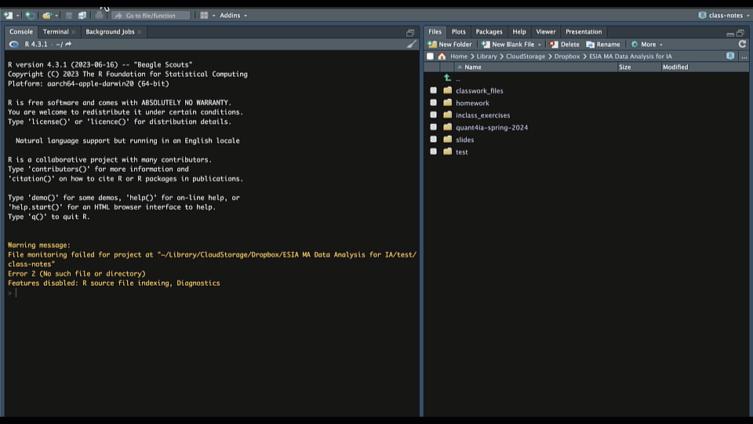
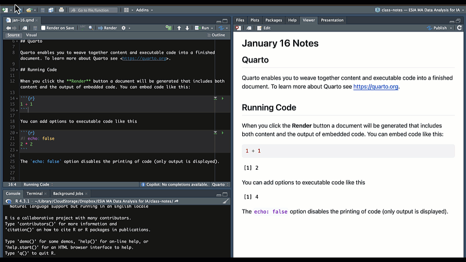

## RStudio

-  RStudio is an integrated development environment (IDE) for R
-  RStudio has four panes
    -   **Source**-where you write code
    -   **Console**-where you run code
    -   **Environment**-where you see objects in memory
    -   **Files/Plots/Packages/Help**-where you can navigate files, see plots, install packages, and get help
- Let's open RStudio and have a look around

## Quarto

<br>

::: {.incremental}
-   [Quarto](https://quarto.org/) is an open-source scientific publishing platform
-   Allows you to integrate text with code
-   Kind of like a word processor for data science
-   Can use it to create reports, books, websites, etc.
-   Can make HTML, PDF, Word, and other formats
-   Can use R, Python, Julia, and other languages
:::

## Project Oriented Workflow

<br>

:::{.incremental}
-   Always start a document in a project folder
    -   That way you don't have to do `setwd`
    -   Also can share easily with other people
-   Go to File\>New Project
-   Create a Quarto project folder
:::

## Visual Editor

::: {.incremental}
-   There are two ways to edit Quarto docs
    -   Source (markdown)
    -   Visual editor
-   Visual editor
    -   WYSIWYM
    -   Approximates appearance
-   Try both and see what you like
:::

## Rendering Documents {.smaller}

::: {.incremental}
-   Rendering = converting to another format
    - Default format is HTML
    - Can also render to PDF, Word, etc. 
-   To render a Quarto document
    -   Click on the Render button
        -   Or keyboard shortcut (Cmd/Ctrl + Shift + K)
-   By default, Quarto will preview the document in your browser
-   But you can also preview in Viewer pane
    - Click on the gear icon next to the Render button
    - Select "Preview in Viewer Pane"
:::

## Illustration

{fig-align="center"}

## Let's Try Quarto!

-   Create a new Quarto document
    -   File\>New File\>Quarto Document
-   Save the document in your project folder
-   Render it
    -   Click on the Render button
    -   Or keyboard shortcut (Cmd/Ctr + Shift + K)
-   Try out the visual editor

```{r}
#| label: timer1

library(countdown)
countdown(minutes = 2, 
          id = "timer1", 
          top = "0%",
          right = "5%",
          color_border = "#fff",
          color_text = "#fff",
          color_running_background = "#42affa",
          color_running_text = "black",
          color_finished_background = "#E5D19D",
          color_finished_text = "#00264A")
```

# Quarto Docs

## Document Elements

<br>

-   YAML Header
-   Markdown content
-   Code chunks

## YAML Header

<br>

-   Metadata about the document
    -   Title, author, date, etc.
-   Output format
-   Execution options

## YAML Header

```         
---
title: "My Documnet"
author: "Your Name"
date: today
date-format: long
format: html
execute:
  echo: false
  message: false
---
```
 - Try adding some of these options in your document
 - Then render it again
 - Look in the Quarto [guide](https://quarto.org/docs/reference/formats/html.html) for other options to try

```{r}
#| label: timer3

countdown(minutes = 2, 
          id = "timer3", 
          bottom = "0%",
          right = "5%")
```

## Markdown

<br>

::: {.incremental}
-   Markdown is a simple markup language
-   You can use it to format text
-   You can also use it to embed images, tables, etc.
-   And to embed code chunks...
:::

## Markdown Syntax - Basic Authoring

::: {.incremental}
-   For basic text you can just start typing
-   For line breaks use two spaces and return (enter)
-   Headings (use `#`, `##`, `###`, etc.)
    -   `#` is the largest heading (level 1)
    -   `##` is the next largest (level 2)
    -   `###` is the next largest (level 3)
    -   Etc.
:::

## Markdown Syntax - Styling

::: {.incremental}
-   Emphasis = Italics (use `*`)
    -   Bold (use `**`)
-   Lists
    -   Bullet points (use `-`)
    -   Numbered lists (use `1.`)
:::

## Markdown Syntax - Content

::: {.incremental}
-   Links (use `[text](url)`)
-   Images (use ``)
-   Code chunks
    -   R code chunks (\`\`\`{r}...\`\`\`)
    -   Python code chunks (\`\`\`{python}...\`\`\`)
    -   Etc. 
:::

## Try Some Markdown

<br>

-   Check out the [Markdown Cheatsheet](https://www.markdownguide.org/basic-syntax/)
-   Try editing the markdown in your document
-   Try some of the other things you find in the guide
-   Then render it again

```{r}
#| label: timer4

countdown(minutes = 10, 
          id = "timer4", 
          bottom = "10%",
          right = "10%")
```

## Code Chunks

::: {.incremental}
-   Incorporate R code (could also be Python, Julia, etc.)
-   Add a code chunk with the '+' button
-   Run the code chunk by clicking the play button
    -   Or use keyboard shortcut (Cmd/Ctrl + Shift + Enter)
-   Run all chunks up that point by clicking the down arrow
    -   Or use keyboard shortcut (Cmd/Ctrl + Shift + K)
-  Run a single line with shortcut (Cmd/Ctrl + Enter) 
:::

## Code Chunk Options

::: {.incremental}
-   Use `#|` (hash-pipe) to add options 
-   `label` is a unique identifier for the chunk
-   Options to control what happens when you render
    -   `echo` controls whether the code is shown
    -   `eval` controls whether the code is run
    -   `message` controls whether messages are shown
    -   `warning` controls whether warnings are shown
:::

## Code Chunk Options

<br>

-   Code-chunk options override global options set in YAML header
-   See [documentation](https://quarto.org/docs/reference/cells/cells-knitr.html) for more options
-   You can also use write chunk options inline with chunk name,
    -   e.g., `{r, echo = FALSE} ...`
    
## Illustration

{fig-align="center"}

## Try it Yourself! 

-  Create a code chunk
-  Copy this code chunk into your document

```{r}
#| label: chunk1
#| echo: true
#| eval: false
#| 
library(ggplot2)

ggplot(mpg, aes(displ, hwy, colour = class)) + 
  geom_point()
```

-  Try adding some chunk options in your document
-  Then render it again

```{r}
#| label: timer5

countdown(minutes = 2,
          id = "timer5",
          bottom = "10%",
          right = "10%")
```

# More About Quarto

## Advanced HTML

<br>

- So far we have been using the basic HTML elements to create our documents
- Quarto supports a wide range of HTML elements and attributes
- We can use these to create more complex and interactive documents

## Formatting Options

- We can make our documents have a more sophisticated feel by specifying various options in the YAML header
- Examples include `title`, `subtitle`, `date`, `abstract`, `toc`, etc.
- We can also specify font styles and colors and control other aspects of the formatting
- See [this page](https://quarto.org/docs/reference/formats/html.html) to explore the various formatting options

## Themes

<br>

- Quarto supports a wide range of themes
- We can use these to change the look and feel of our documents
- Check out [this page](https://quarto.org/docs/output-formats/html-themes.html) to explore the various themes available in Quarto

## Footnotes

<br>

- You can also add footnotes to your document
- Use the `^[]` or `[^1]` syntax to add a footnote
- There are different ways to add footnotes
- I find that inline notes are the easiest to work with
  - For example `^[This is a footnote]`

## Generating Lorem Ipsum

<br>

- For working on your document's format it is helpful to have random text
- The [lorem package](http://pkg.garrickadenbuie.com/lorem/) is helpful for this
- You can also install an R Studio Addin

## Your Turn!

- Start a new Quarto project
- Create a new Quarto document in your project folder
- Add a YAML header with the following options:
  - `title:`
  - `subtitle:`
  - `date:`
  - `date-format:`
  - `theme:`
  - `toc:`

## Your Turn!

- Try adding at least one more option to your YAML header
- Generate some sections and some random text using the `lorem` package
- Add some code chunks to your document (and some code)
- Add some footnotes to your document
- Render the document and see what it looks like


