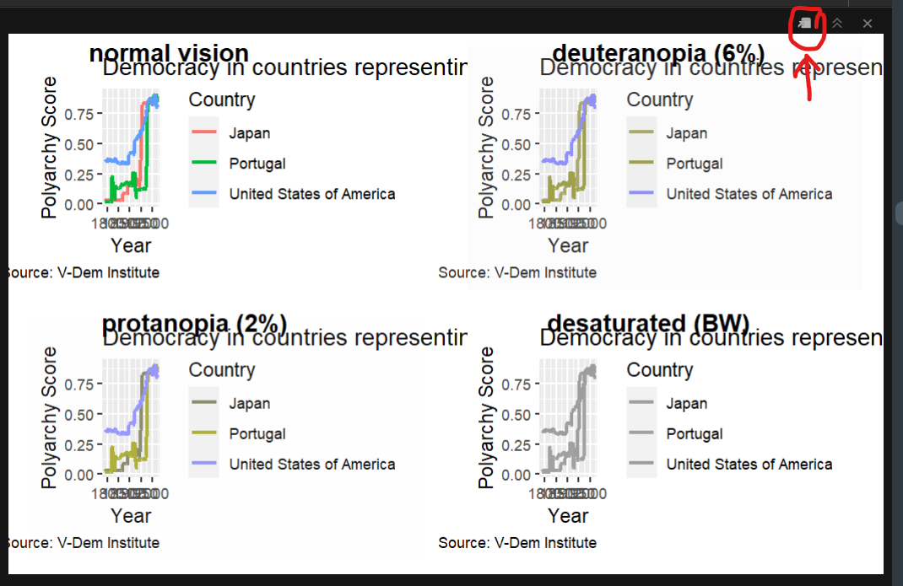

```{r}
#| label: setup

library(readr)
library(dplyr)
library(tidyr)
library(ggplot2)
library(wbstats)
library(colorBlindness)

## Line chart data--our running example for this lesson

dem_waves_ctrs <- read_csv("data/dem_waves_ctrs.csv")

## Cross-section of data on FLFP and GDP per capita for scatter plot

indicators = c(flfp = "SL.TLF.CACT.FE.ZS", gdp_pc = "NY.GDP.PCAP.KD") # define indicators

flfp_gdp <- wb_data(indicators, end_date = 2021) |> # download data for 2021
    left_join(select(wb_countries(), c(iso3c, region)), by = "iso3c") |>  # add regions
    drop_na() # drop rows with missing values
```

## Color Blindness

<br>

- Color Vision Deficiency (CVD) or color blindness affects 8 percent of men and 1 in 200 women
- There are different types of CVD but most common is red-green color blindness
- Therefore, don't include red and green in the same chart!
- Look for color blind safe palettes

## Color Should Carry Information

<br>

- Color is a **third dimension** of your data, not decoration
- If your x-axis already shows the categories, coloring by that same variable adds nothing
- In the line chart below, color is doing real work--it is the only thing telling the three countries apart
- That is exactly why the color scheme has to be readable for everyone

## Last Week's Line Chart

```{r}
#| label: line_chart

dem_waves_chart <- ggplot(dem_waves_ctrs, aes(x = year, y = polyarchy, color = country)) +
  geom_line(linewidth = 1) + # our geom is a line with a width of 1
  labs(
    x = "Year",
    y = "Polyarchy Score",
    title = 'Democracy in countries representing three different "waves"',
    caption = "Source: V-Dem Institute",
    color = "Country" # make title of legend to upper case
  )

dem_waves_chart
```

## Last Week's Line Chart

<br>

Create last week's line chart and save it as an object...

```{r}
#| label: line_chart_setup
#| echo: true
#| output: false

dem_waves_ctrs <- read_csv("data/dem_waves_ctrs.csv")

dem_waves_chart <- ggplot(dem_waves_ctrs, aes(x = year, y = polyarchy, color = country)) +
  geom_line(linewidth = 1) + # our geom is a line with a width of 1
  labs(
    x = "Year",
    y = "Polyarchy Score",
    title = 'Democracy in countries representing three different "waves"',
    caption = "Source: V-Dem Institute",
    color = "Country" # make title of legend to upper case
  )
```

## Checking Your Colors

```{r}
#| label: cvdPlot_output

# drop the title/caption so the four panels stay legible on a slide
dem_waves_bare <- dem_waves_chart + labs(title = NULL, caption = NULL)

cvdPlot(dem_waves_bare)
```

## Checking Your Colors {.smaller}

<br>

Call `cvdPlot()` from the `colorBlindness` package. CVD stands for "color vision deficiency."

```{r}
#| label: cvdPlot_code
#| echo: true
#| output: false

library(colorBlindness)

cvdPlot(dem_waves_chart)
```

<br>

Click on the little image in the plot pane to expand your view...

{fig-align="center" width="45%"}

## Your Turn!

<br>

- Take your `dem_waves_chart` object and run `cvdPlot()` on it
- Expand the window and have a good look
- Which group would have the toughest time reading this graph?

```{r}
#| label: timer1
countdown::countdown(minutes = 5,
                     id = "timer1",
                     #bottom = "10%",
                     #right = "10%",
                     color_border = "#fff",
                     color_text = "#fff",
                     color_running_background = "#42affa",
                     color_running_text = "black",
                     color_finished_background = "#E5D19D",
                     color_finished_text = "#00264A")
```

## Two Palettes That Work {.smaller}

<br>

- **Okabe-Ito** -- hex codes, no package needed, built for red-green CVD
- **Viridis** -- built into `ggplot2`, works for discrete *and* continuous data, and stays readable in grayscale

<br>

Also worth knowing:

- **ColorBrewer** is built into `ggplot2` too, but only *some* of its palettes are safe--use the [selector tool](https://colorbrewer2.org/) and check the "colorblind safe" box
- **[paletteer](https://emilhvitfeldt.github.io/paletteer/)** collects thousands of palettes from across R. Great for browsing, but most of them were never designed with accessibility in mind--so check before you commit

## Okabe-Ito

```{r}
#| label: your_own_palette1

cb_palette <- c("#E69F00", "#56B4E9", "#009E73", "#F0E442", "#0072B2", "#D55E00", "#CC79A7")

dem_waves_chart + scale_color_manual(values = cb_palette)
```

## Okabe-Ito {.smaller}

<br>

The **Okabe-Ito** palette is eight colors chosen specifically to stay distinguishable under red-green CVD. There is no package to install--just a vector of hex codes that you apply with `scale_color_manual()`...

```{r}
#| label: your_own_palette2
#| echo: true
#| output: false
#| code-line-numbers: "1|3"

cb_palette <- c("#E69F00", "#56B4E9", "#009E73", "#F0E442", "#0072B2", "#D55E00", "#CC79A7")

dem_waves_chart + scale_color_manual(values = cb_palette)
```

## Viridis

```{r}
#| label: viridis
#| echo: true

dem_waves_chart + scale_color_viridis_d()
```

## ColorBrewer {.smaller}

Our countries are unordered categories, so we want a *qualitative* palette. `Dark2` is the one that holds up best under CVD.

```{r}
#| label: color_brewer
#| echo: true

dem_waves_chart + scale_color_brewer(palette = "Dark2")
```

## Not Every Palette Is Safe

Picking *a* palette is not the same as picking an *accessible* one...

```{r}
#| label: unsafe
#| echo: true

dem_waves_chart + scale_color_brewer(palette = "RdYlGn")
```

## Not Every Palette Is Safe

Japan and the United States collapse into the same color--always check!

```{r}
#| label: unsafe_cvd
#| echo: true

cvdPlot(dem_waves_bare + scale_color_brewer(palette = "RdYlGn"))
```

## Ask Your AI {.smaller}

<br>

When in doubt, paste your chart image--or just your hex codes--into an AI assistant and ask:

> *"Is this color scheme readable for someone with deuteranopia or protanopia? If not, suggest an accessible alternative and give me the `ggplot2` code."*

<br>

**Good for:** spotting risky combinations, suggesting a better palette, writing the `scale_color_*` call for you.

**Keep in mind:** the AI is *eyeballing* your chart. `cvdPlot()` actually simulates the deficiency. Use the AI to pick a palette, then verify with `cvdPlot()`.

## Your Turn!

- Go to [Module 2.2](https://dataviz-gwu.rocks/modules/module-2.2) on the course website
- Do the setup steps and rebuild the line chart
- Apply the Okabe-Ito palette with `scale_color_manual()`
- Try changing one of the [hex codes](https://htmlcolorcodes.com/), then swap in `scale_color_viridis_d()`
- Run `cvdPlot()` on each one--which holds up best?
- Time permitting, try a [coolors palette](https://coolors.co/) or [GW colors](https://communications.gwu.edu/visual-identity/color-palette)

```{r}
#|label: custom_palette_timer
countdown::countdown(minutes = 10,
                     id = "dem_waves",
                     #bottom = "10%",
                     right = "5%")
```

## Fill vs. Color {.smaller}

<br>

Use **fill** (`fill =` or `scale_fill_*`) for the inside of shapes:

- Bar charts, box plots, histograms

<br>

Use **color** (`color =` or `scale_color_*`) for points, lines, and text:

- Scatter plots, line charts, text elements

<br>

Every palette we just saw has both versions, e.g. `scale_fill_viridis_d()` and `scale_color_viridis_d()`.

## Scaling for Scatter Plots

```{r}
#| label: scatterplot1

wealth_flfp <- ggplot(flfp_gdp, aes(x = gdp_pc, y = flfp)) +
  geom_point(aes(color = region)) + # color points by region
  geom_smooth(method = "loess", linewidth = 1) +  # make the line a loess curve
  scale_x_log10(labels = scales::label_dollar()) + # stretch axis, add '$' format
  scale_y_continuous(labels = scales::label_percent(scale = 1)) + # add % label
  labs(
    x= "GDP per Capita", # x-axis title
    y = "Female Labor Force Participation", # y-axis title
    title = "Wealth and female labor force participation", # plot title
    caption = "Source: World Bank Development Indicators", # caption
    color = "Region" # legend title
    )

wealth_flfp + scale_color_viridis_d(option = "plasma")
```

## Scaling for Scatter Plots

<br>

```{r}
#| label: scatterplot2
#| echo: true
#| output: false
#| code-line-numbers: "14"

wealth_flfp <- ggplot(flfp_gdp, aes(x = gdp_pc, y = flfp)) +
  geom_point(aes(color = region)) + # color points by region
  geom_smooth(method = "loess", linewidth = 1) +  # make the line a loess curve
  scale_x_log10(labels = scales::label_dollar()) + # stretch axis, add '$' format
  scale_y_continuous(labels = scales::label_percent(scale = 1)) + # add % label
  labs(
    x= "GDP per Capita", # x-axis title
    y = "Female Labor Force Participation", # y-axis title
    title = "Wealth and female labor force participation", # plot title
    caption = "Source: World Bank Development Indicators", # caption
    color = "Region" # legend title
    )

wealth_flfp + scale_color_viridis_d(option = "plasma")
```

## Tuning the Scale

Use `end` to darken the colors. `direction = -1` flips the scale.

```{r}
#| label: viridis_tuning
#| echo: true

wealth_flfp + scale_color_viridis_d(option = "plasma", end = .7)
```

## Your Turn!

<br>

- Try using one of the color schemes on the scatter plot
- Use `scale_color_` instead of `scale_fill_`
- Play around with the `end` and `direction` arguments in `viridis`
- A full list of viridis schemes is [here](https://search.r-project.org/CRAN/refmans/viridisLite/html/viridis.html)
- For ColorBrewer, check out this [selector tool](https://colorbrewer2.org/#type=sequential&scheme=BuGn&n=3)
- For paletteer, check out this [paletteer gallery](https://pmassicotte.github.io/paletteer_gallery/)

```{r}
#|label: scatter_plot_timer
countdown::countdown(minutes = 5,
                     id = "scatter_plot",
                     bottom = "10%",
                     right = "5%")
```
